# FFSD Mid-Review — Test Plan

Project Title: Build & Beyond

Group No: 38

Frontend Framework: HTML + CSS +EJS

Backend: Node.js + Express + MongoDB

Description: This document contains the test plan for the Framework Driven Front-End Development (FFSD) mid-review submission. The tests focus on three areas required by the assignment: form validations (DOM-based), dynamic HTML implementation (dynamic rendering of components/lists/cards), and asynchronous data handling (fetch/axios). Evidence (screenshots) are placed in the `/test_plsn/` folder inside the zip submission.
---

## Test Environment

| Item | Details |
|---|---|
| Browsers | Google Chrome vlatest, Mozilla Firefox latest, Microsoft Edge latest |
| OS | Windows 10/11 |
| Backend | Node.js 14+ (as used in project) with local MongoDB or MongoDB Atlas |
| Tools | Postman (for manual API checks), Chrome DevTools, VS Code |
| Evidence folder | `/test_plan/` (screenshots) |

---

## Test Cases: Form Validation (DOM)

### Test Case 1

| Field | Value |
|---:|---|
| Test Case ID | Test Case 1 |
| Feature | Customer Signup - Empty Fields Validation |
| Test Objective | Verify the customer signup form prevents submission when required inputs are missing and shows helpful messages |
| Expected Result | Submission blocked; inline errors are shown. Evidence: `test_plan/customer_signup_emptyfields.jpg`. |
| Actual Result | (to be filled) |
| Status | Pass |
| Evidence | 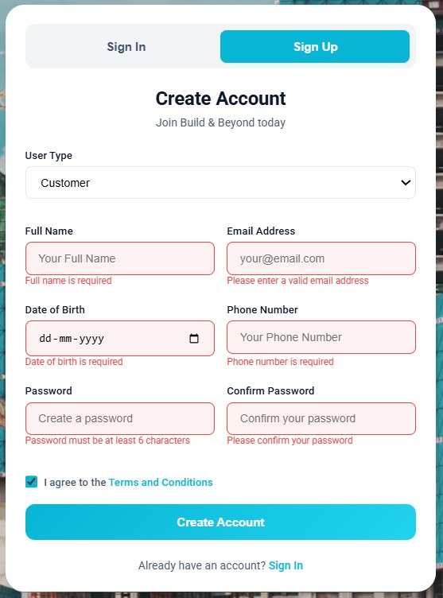 |

### Test Case 2

| Field | Value |
|---:|---|
| Test Case ID | Test Case 2 |
| Feature | Customer Signup - Invalid Full Flow |
| Test Objective | Verify customer signup rejects invalid inputs and shows appropriate messages |
| Expected Result | Submission blocked; errors shown. Evidence: `customer_signup_invalid.png`. |
| Actual Result | (to be filled) |
| Status | Pass |
| Evidence | 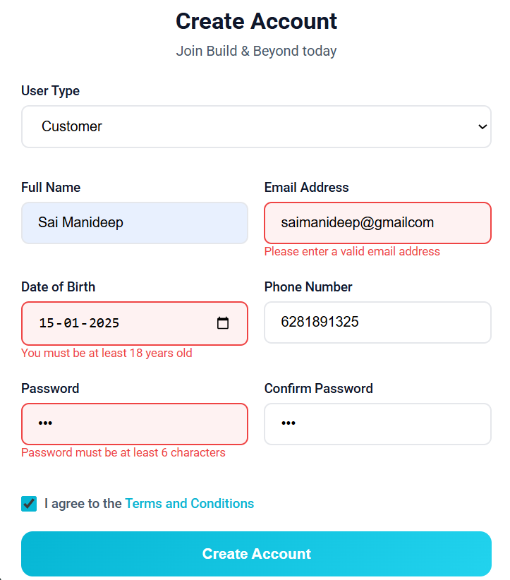 |

### Test Case 3

| Field | Value |
|---:|---|
| Test Case ID | Test Case 3 |
| Feature | Company Signup - Empty Fields Validation |
| Test Objective | Verify the company signup form validates required fields and prevents submission when essential fields are empty |
| Expected Result | Submission blocked; inline validation messages appear for each empty required field. Evidence: `test_plan/company_signup_emptyfields.jpg`. |
| Actual Result | (to be filled) |
| Status | Pass |
| Evidence | 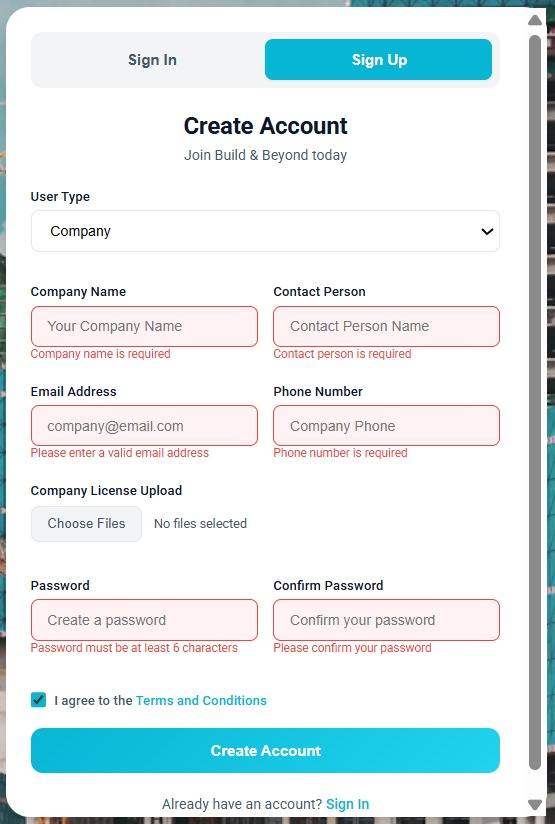 |

### Test Case 4

| Field | Value |
|---:|---|
| Test Case ID | Test Case 4 |
| Feature | Company Signup - Invalid (full flow) |
| Test Objective | Verify company signup rejects invalid inputs and shows errors (beyond just email) |
| Expected Result | Inline validation and/or server response reject submission. Evidence: `company_signup_invalid.png`. |
| Actual Result | (to be filled) |
| Status | Pass |
| Evidence | 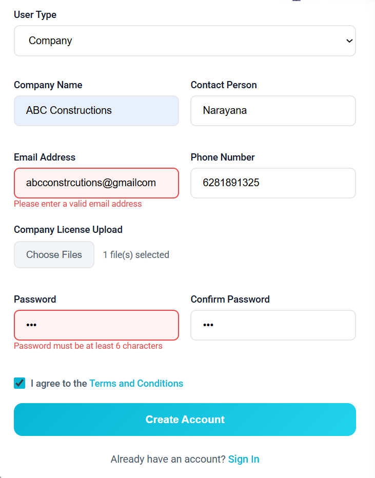 |

### Test Case 5

| Field | Value |
|---:|---|
| Test Case ID | Test Case 5 |
| Feature | Worker Signup - Empty Fields Validation |
| Test Objective | Verify worker signup enforces required inputs and shows errors for empty required fields |
| Expected Result | Form submission is prevented; inline errors displayed. Evidence: `test_plan/worker_signup_emptyfields.jpg`. |
| Actual Result | (to be filled) |
| Status | Pass |
| Evidence | 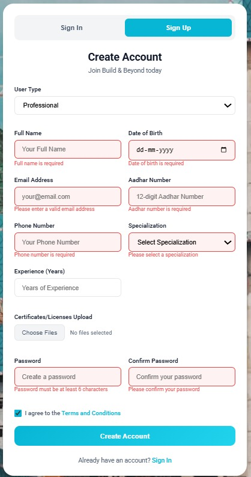 |
| Feature | Project Request Form - Numeric and Length Validation (Phone) |
| Test Objective | Verify phone input accepts only numeric characters and enforces length (10 digits) |
| Expected Result | Non-numeric input rejected; 9-digit input triggers validation error; 10-digit accepted and submission proceeds. |
| Actual Result | (to be filled) |
| Status | Pass |
| Evidence | (none) |

---
### Test Case 6

| Field | Value |
|---:|---|
| Test Case ID | Test Case 6 |
| Feature | Worker Signup - Invalid Full Flow |
| Test Objective | Verify worker signup rejects invalid inputs and shows appropriate messages |
| Expected Result | Submission blocked and errors displayed. Evidence: `worker_signup_invalid.png`. |
| Actual Result | (to be filled) |
| Status | Pass |
| Evidence | 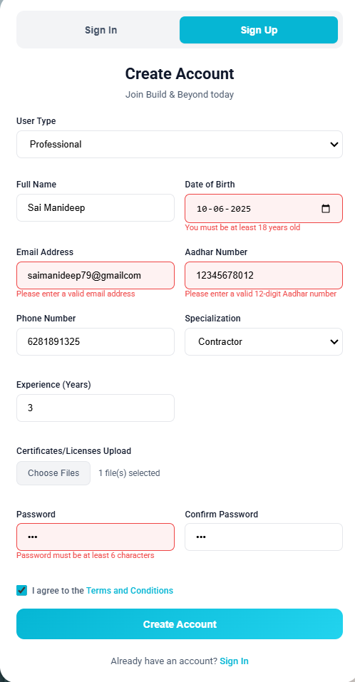 |

---
### Test Case 7

| Field | Value |
|---:|---|
| Test Case ID | Test Case 7 |
| Feature | Admin Login - Empty Fields Validation |
| Test Objective | Verify the admin login form prevents submission and shows inline errors when required fields are left empty |
| Expected Result | Submission blocked; inline errors appear near Email and Password fields. Evidence: `test_plan/admin_login_empty_fields.jpg`. |
| Actual Result | (to be filled) |
| Status | Pass |
| Evidence | 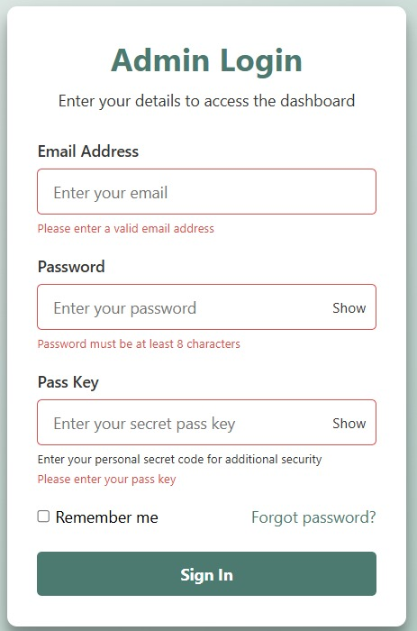 |

---
### Test Case 8

| Field | Value |
|---:|---|
| Test Case ID | Test Case 8 |
| Feature | Login Form - Password Required and Strength Hint |
| Test Objective | Verify password required validation and (if available) client-side password strength hints |
| Expected Result | Login is blocked; an error near password field appears. If password strength UI exists, test it separately by entering `abc` (weak) and `Test@1234` (strong). |
| Actual Result | (to be filled) |
| Status | Pass |
| Evidence | 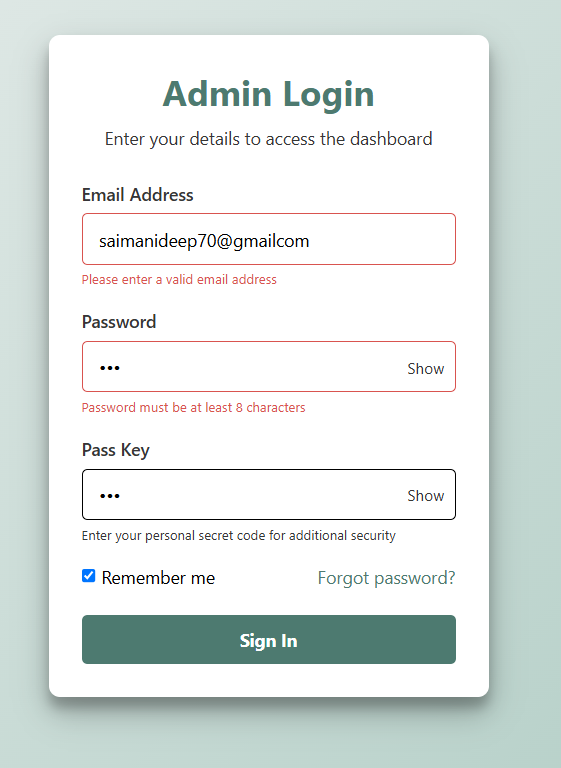 |

### Test Case 9

| Field | Value |
|---:|---|
| Test Case ID | Test Case 9 |
| Feature | Architect Form - Email Format Validation |
| Test Objective | Verify client-side validation rejects invalid email formats |
| Expected Result | Inline validation shows "Enter a valid email" and submission is blocked. |
| Actual Result | (to be filled) |
| Status | Pass |
| Evidence | 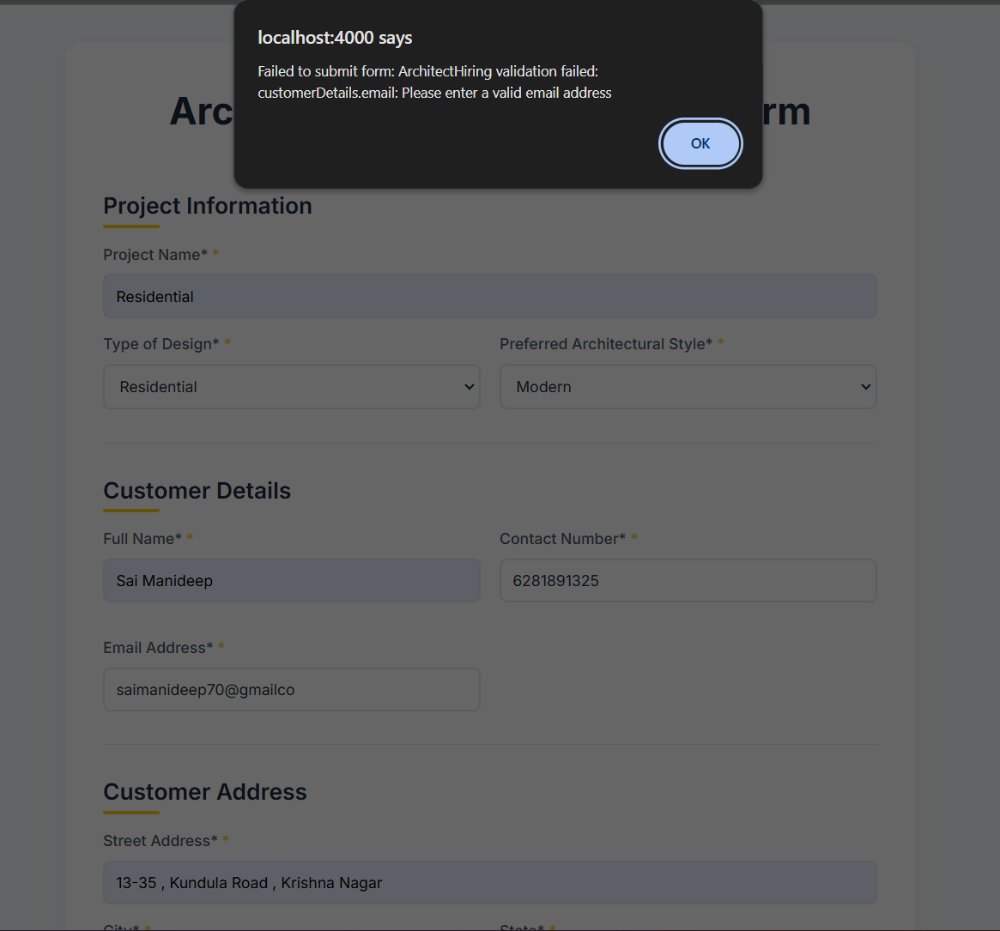 |

### Test Case 10

| Field | Value |
|---:|---|
| Test Case ID | Test Case 10 |
| Feature | File Upload Validation in Design Request Form|
| Test Objective | Verify invalid file types or oversized files are rejected client-side or server-side and appropriate message shown |
| Expected Result | Upload prevented/returns 4xx; inline error message shown. Evidence: `architect_file_upload_invalid.png`. |
| Actual Result | (to be filled) |
| Status | Pass |
| Evidence | 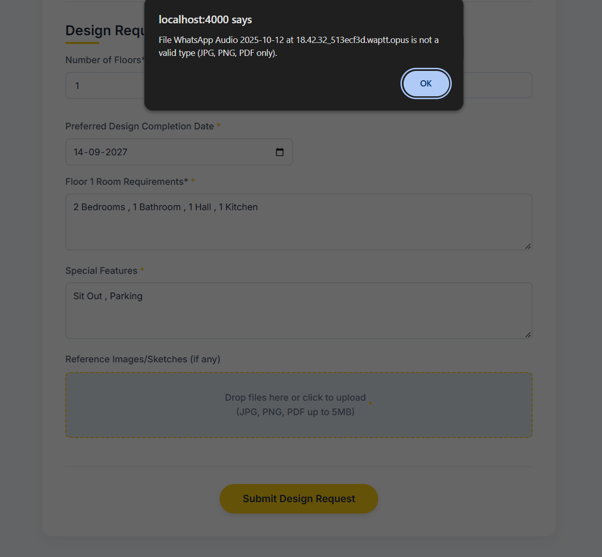 |

---

### Test Case 11

| Field | Value |
|---:|---|
| Test Case ID | Test Case 11 |
| Feature | Company Bid Submission - Invalid Payload |
| Test Objective | Verify that invalid bid submissions are rejected and appropriate errors are returned/shown |
| Expected Result | POST returns 4xx with error payload; UI displays validation error. Evidence: `company_bid_submission_invalid.png`. |
| Actual Result | (to be filled) |
| Status | Pass |
| Evidence | 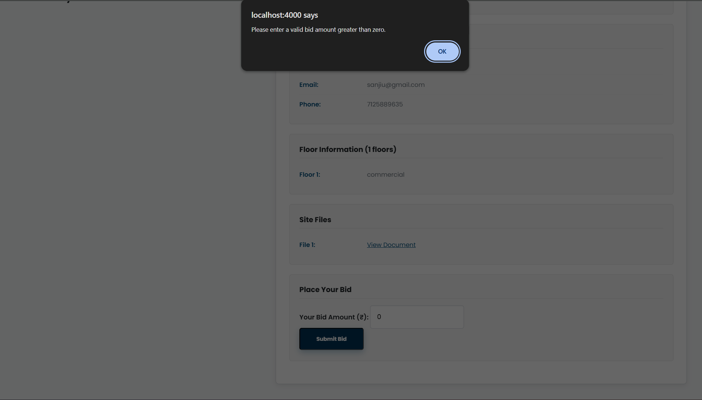 |

---

### Test Case 12

| Field | Value |
|---:|---|
| Test Case ID | Test Case 12 |
| Feature | Company Hire Worker - Already Requested |
| Test Objective | Verify company cannot hire a worker when he already sends him an offer request |
| Expected Result | Submission blocked and error message shown. Evidence: `company_hire_worker_invalid.png`. |
| Actual Result | (to be filled) |
| Status | Pass |
| Evidence | 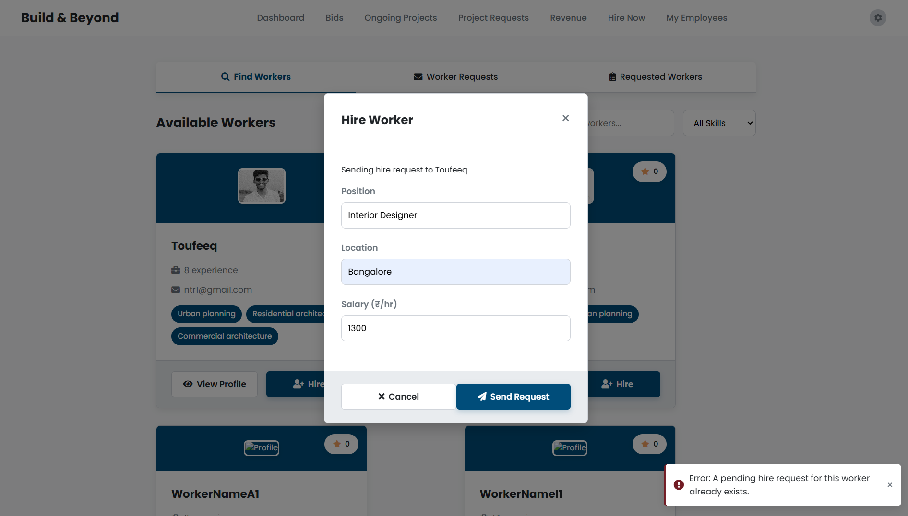 |

---

### Test Case 13

| Field | Value |
|---:|---|
| Test Case ID | Test Case 13 |
| Feature | Proposal Submit Tooltip / UI Feedback |
| Test Objective | Verify tooltip or contextual help appears when proposal submission is invalid and prevents confusion |
| Expected Result | Tooltip shown explaining missing fields or next steps. Evidence: `company_proposal_submit_tooltip_invalid.png`. |
| Actual Result | (to be filled) |
| Status | Pass |
| Evidence | 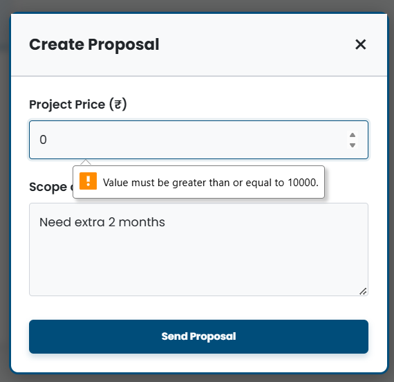 |

---

### Test Case 14

| Field | Value |
|---:|---|
| Test Case ID | Test Case 14 |
| Feature | Construction Form - Floors Numeric Validation |
| Test Objective | Verify that the "floors" input accepts only numeric values and enforces reasonable bounds |
| Expected Result | Non-numeric/invalid values rejected; valid numeric accepted. Evidence: `construction_floors_invalid.png`. |
| Actual Result | (to be filled) |
| Status | Pass |
| Evidence | 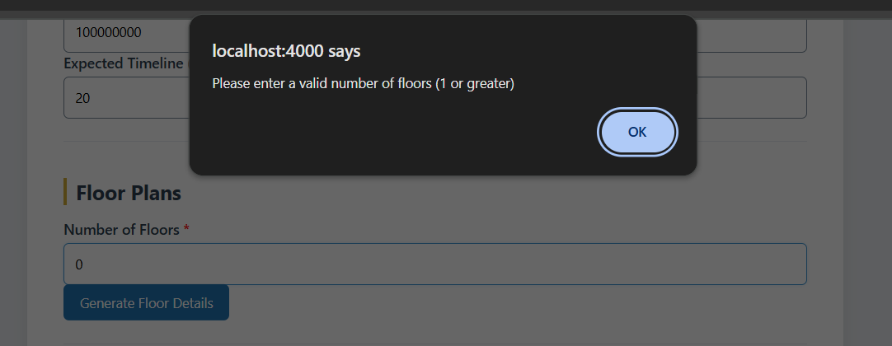 |

---

### Test Case15

| Field | Value |
|---:|---|
| Test Case ID | Test Case15 |
| Feature | Worker-to-Company Association Failure |
| Test Objective | Verify the email and linked url provided by worker|
| Expected Result | UI shows error and does not leave stale state. Evidence: `workertocompany_invalid.png`. |
| Actual Result | (to be filled) |
| Status | Pass |
| Evidence | 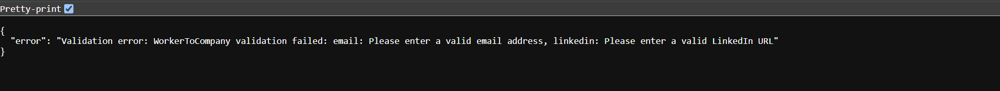 |

---

## Test Cases: Async Data Handling (fetch / axios)

### Test Case - 1

| Field | Value |
|---:|---|
| Test Case ID | Test Case - 1 |
| Feature | Fetch Error - 1 |
| Test Objective | Sign in page fetch error when typing wrong username/password |
| Expected Result | |
| Actual Result | |
| Status | Pass |
| Evidence | 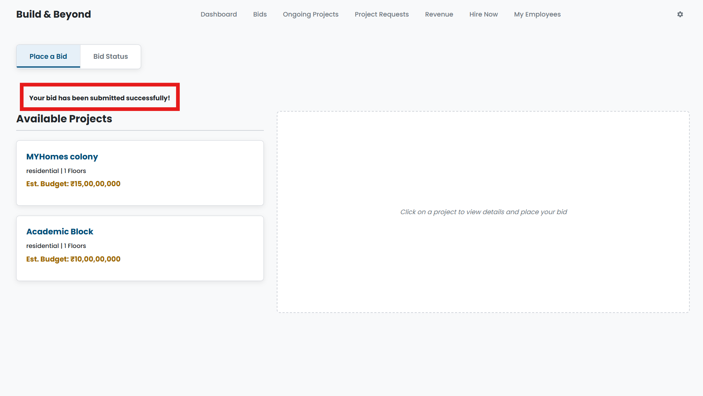 |

### Test Case - 2

| Field | Value |
|---:|---|
| Test Case ID | Test Case - 2 |
| Feature | Retrieve Projects (GET) |
| Test Objective | Verify GET request returns a list and the front-end renders it correctly |
| Expected Result | GET returns 200 with JSON array; UI renders each item as a card/list row. Save response screenshot `/network_evidence/TC-AD-002_get_list.png`. |
| Actual Result | (to be filled) |
| Status | Pass |
| Evidence | (none) |

### Test Case - 3

| Field | Value |
|---:|---|
| Test Case ID | Test Case - 3 |
| Feature | Delete Project (DELETE) |
| Test Objective | Verify client sends DELETE request and the UI removes the item without full refresh |
| Expected Result | DELETE returns 200/204 and UI removes card dynamically. Save screenshot `/network_evidence/TC-AD-003_delete_success.png`. |
| Actual Result | (to be filled) |
| Status | Pass |
| Evidence | (none) |

## Evidence

Evidence screenshots are in test_plan

---