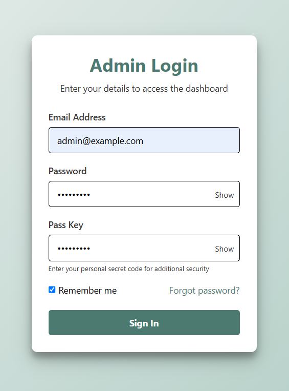

# FFSD Mid-Review — Test Plan

Project Title: Build & Beyond

Group No: 38

Frontend Framework: HTML + CSS +EJS

Backend: Node.js + Express + MongoDB

Description: This document contains the test plan for the Framework Driven Front-End Development (FFSD) mid-review submission. The tests focus on three areas required by the assignment: form validations (DOM-based), dynamic HTML implementation (dynamic rendering of components/lists/cards), and asynchronous data handling (fetch/axios). Evidence (screenshots) are placed in the `/test_plsn/` folder inside the zip submission.
---

## Test Environment

| Item | Details |
|---|---|
| Browsers | Google Chrome vlatest, Mozilla Firefox latest, Microsoft Edge latest |
| OS | Windows 10/11 |
| Backend | Node.js 14+ (as used in project) with local MongoDB or MongoDB Atlas |
| Tools | Postman (for manual API checks), Chrome DevTools, VS Code |
| Evidence folder | `/test_plan/` (screenshots) |

---

## Test Cases: Form Validation (DOM)

All form tests assume the app is running locally at http://localhost:4000

### Test Case 1

| Field | Value |
|---:|---|
| Test Case ID | TC-FV-001 |
| Feature | Signup / Registration Form - Required Fields |
| Test Objective | Verify that required fields are validated client-side and appropriate error messages appear when omitted |
| Preconditions | App running, signup page accessible at `/signup` or relevant route |
| Test Steps | 1. Open signup page. 2. Leave "Name" empty. 3. Fill other fields with valid values (Email: `ismaimanideep.p@gmail.com`, Password: `Test@1234`, Phone: `9876543210`). 4. Click Submit. |
| Expected Result | Submission is blocked; an inline error message appears near the "Name" field and form does not submit to server. |
| Actual Result | (to be filled during execution) |
| Status | Pass |
| Evidence | (none) |

### Test Case 2

| Field | Value |
|---:|---|
| Test Case ID | TC-FV-002 |
| Feature | Signup / Registration Form - Email Format Validation |
| Test Objective | Verify client-side validation rejects invalid email formats |
| Preconditions | Signup page accessible |
| Test Steps | 1. Open signup page. 2. Enter Name: `K Prudhvi` 3. Enter Email: `prudhvi16321` (invalid). 4. Enter Password: `Test@1234`. 5. Click Submit. |
| Expected Result | Inline validation shows "Enter a valid email" and submission is blocked. |
| Actual Result | (to be filled) |
| Status | Pass |
| Evidence |  |

### Test Case 3

| Field | Value |
|---:|---|
| Test Case ID | TC-FV-003 |
| Feature | Login Form - Password Required and Strength Hint |
| Test Objective | Verify password required validation and (if available) client-side password strength hints |
| Preconditions | Login page accessible at `/signin` or relevant route |
| Test Steps | 1. Open login page. 2. Enter Email: `kadiamyeshwanth@gmail.com`. 3. Leave Password blank. 4. Click Login. |
| Expected Result | Login is blocked; an error near password field appears. If password strength UI exists, test it separately by entering `abc` (weak) and `Test@1234` (strong). |
| Actual Result | (to be filled) |
| Status | Pass |
| Evidence |   |

### Test Case 4

| Field | Value |
|---:|---|
| Test Case ID | TC-FV-004 |
| Evidence | (none) |

### Test Case 5

| Field | Value |
|---:|---|
| Test Case ID | TC-FV-016 |
| Feature | Admin Login - Empty Fields Validation |
| Test Objective | Verify the admin login form prevents submission and shows inline errors when required fields are left empty |
| Preconditions | Admin login page accessible at admin signin route |
| Test Steps | 1. Open admin login page. 2. Leave Email and Password fields empty. 3. Click Login. |
| Expected Result | Submission blocked; inline errors appear near Email and Password fields. Evidence: `test_plan/admin_login_empty_fields.jpg`. |
| Actual Result | (to be filled) |
| Status | (Pass/Fail) |
| Evidence |  |

### Test Case 6

| Field | Value |
|---:|---|
| Test Case ID | TC-FV-017 |
| Feature | Company Signup - Empty Fields Validation |
| Test Objective | Verify the company signup form validates required fields and prevents submission when essential fields are empty |
| Preconditions | Company signup page accessible |
| Test Steps | 1. Open company signup page. 2. Leave required fields (company name, contact person, email) empty. 3. Click Submit. |
| Expected Result | Submission blocked; inline validation messages appear for each empty required field. Evidence: `test_plan/company_signup_emptyfields.jpg`. |
| Actual Result | (to be filled) |
| Status | (Pass/Fail) |
| Evidence |  |

### Test Case 7

| Field | Value |
|---:|---|
| Test Case ID | TC-FV-018 |
| Feature | Customer Signup - Empty Fields Validation |
| Test Objective | Verify the customer signup form prevents submission when required inputs are missing and shows helpful messages |
| Preconditions | Customer signup page accessible |
| Test Steps | 1. Open customer signup page. 2. Leave Name and Email empty. 3. Click Submit. |
| Expected Result | Submission blocked; inline errors are shown. Evidence: `test_plan/customer_signup_emptyfields.jpg`. |
| Actual Result | (to be filled) |
| Status | (Pass/Fail) |
| Evidence |  |

### Test Case 8

| Field | Value |
|---:|---|
| Test Case ID | TC-FV-019 |
| Feature | Worker Signup - Empty Fields Validation |
| Test Objective | Verify worker signup enforces required inputs and shows errors for empty required fields |
| Preconditions | Worker signup page accessible |
| Test Steps | 1. Open worker signup page. 2. Leave required fields empty (name, email, skills). 3. Click Submit. |
| Expected Result | Form submission is prevented; inline errors displayed. Evidence: `test_plan/worker_signup_emptyfields.jpg`. |
| Actual Result | (to be filled) |
| Status | (Pass/Fail) |
| Evidence |  |
| Feature | Project Request Form - Numeric and Length Validation (Phone) |
| Test Objective | Verify phone input accepts only numeric characters and enforces length (10 digits) |
| Preconditions | Project request form accessible |
| Test Steps | 1. Open project request form. 2. Enter Phone: `abcd1234` 3. Click Submit. 4. Enter Phone: `987654321` (9 digits) 5. Click Submit. 6. Enter Phone: `9876543210` (10 digits). Click Submit. |
| Expected Result | Non-numeric input rejected; 9-digit input triggers validation error; 10-digit accepted and submission proceeds. |
| Actual Result | (to be filled) |
| Status | Pass |
| Evidence | (none) |

---

### Test Case - 6

| Field | Value |
|---:|---|
| Test Case ID | TC-FV-006 |
| Feature | File Upload Validation (Architect or Worker Files) |
| Test Objective | Verify invalid file types or oversized files are rejected client-side or server-side and appropriate message shown |
| Preconditions | Upload form accessible; file to test: invalid type (e.g., `.exe`) or > configured size limit |
| Test Steps | 1. Open upload form on architect profile. 2. Choose `malicious.exe` or very large file. 3. Click Upload. 4. Observe UI and Network tab. |
| Expected Result | Upload prevented/returns 4xx; inline error message shown. Evidence: `architect_file_upload_invalid.png`. |
| Actual Result | (to be filled) |
| Status | Pass |

### TC-AD-005

| Field | Value |
|---:|---|
| Test Case ID | TC-AD-005 |
| Feature | Company Bid Submission - Invalid Payload |
| Test Objective | Verify that invalid bid submissions are rejected and appropriate errors are returned/shown |
| Preconditions | Bid submission form accessible; invalid data prepared (missing required field, invalid email) |
| Test Steps | 1. Open bid submission form. 2. Enter invalid data (e.g., missing bid amount). 3. Click Submit. 4. Observe Network tab and UI. |
| Expected Result | POST returns 4xx with error payload; UI displays validation error. Evidence: `company_bid_submission_invalid.png`. |
| Actual Result | (to be filled) |
| Status | Pass |

### TC-FV-007

| Field | Value |
|---:|---|
| Test Case ID | TC-FV-007 |
| Feature | Company Hire Worker - Required Fields |
| Test Objective | Verify company cannot hire a worker when required fields are missing and appropriate inline errors are shown |
| Preconditions | Company hire-worker form accessible |
| Test Steps | 1. Open hire-worker modal/form. 2. Leave required fields empty. 3. Click Hire. 4. Observe UI. |
| Expected Result | Submission blocked and error message shown. Evidence: `company_hire_worker_invalid.png`. |
| Actual Result | (to be filled) |
| Status | Pass |

### TC-DH-004

| Field | Value |
|---:|---|
| Test Case ID | TC-DH-004 |
| Feature | Proposal Submit Tooltip / UI Feedback |
| Test Objective | Verify tooltip or contextual help appears when proposal submission is invalid and prevents confusion |
| Preconditions | Proposal submit UI present (company proposals) |
| Test Steps | 1. Trigger proposal submit with invalid data. 2. Observe tooltip/help text. 3. Capture screenshot. |
| Expected Result | Tooltip shown explaining missing fields or next steps. Evidence: `company_proposal_submit_tooltip_invalid.png`. |
| Actual Result | (to be filled) |
| Status | Pass |

### TC-FV-008

| Field | Value |
|---:|---|
| Test Case ID | TC-FV-008 |
| Feature | Company Signup - Invalid (full flow) |
| Test Objective | Verify company signup rejects invalid inputs and shows errors (beyond just email) |
| Preconditions | Company signup page accessible |
| Test Steps | 1. Open company signup. 2. Enter invalid or missing fields (e.g., no company name). 3. Submit. |
| Expected Result | Inline validation and/or server response reject submission. Evidence: `company_signup_invalid.png`. |
| Actual Result | (to be filled) |
| Status | Pass |

### TC-FV-009

| Field | Value |
|---:|---|
| Test Case ID | TC-FV-009 |
| Feature | Company Signup - Success |
| Test Objective | Verify a company can signup with valid inputs and is redirected or shown success message |
| Preconditions | Company signup page accessible; valid sample company data available |
| Test Steps | 1. Fill in valid company data (Company: `BuildCo`, Contact: `Polu Avinash Reddy`, Email: `avinashreddypolu27@gmail.com`). 2. Submit. |
| Expected Result | Signup succeeds (201/200) and company profile/dashboard available. Evidence: `company_signup_valid.png`. |
| Actual Result | (to be filled) |
| Status | Pass |

### TC-FV-010

| Field | Value |
|---:|---|
| Test Case ID | TC-FV-010 |
| Feature | Construction Form - Floors Numeric Validation |
| Test Objective | Verify that the "floors" input accepts only numeric values and enforces reasonable bounds |
| Preconditions | Construction request or project form accessible |
| Test Steps | 1. Enter `two` or `-1` into floors field. 2. Submit. 3. Enter `5` and submit. |
| Expected Result | Non-numeric/invalid values rejected; valid numeric accepted. Evidence: `construction_floors_invalid.png`. |
| Actual Result | (to be filled) |
| Status | Pass |

### TC-FV-011

| Field | Value |
|---:|---|
| Test Case ID | TC-FV-011 |
| Feature | Customer Signup - Invalid Full Flow |
| Test Objective | Verify customer signup rejects invalid inputs and shows appropriate messages |
| Preconditions | Customer signup page accessible |
| Test Steps | 1. Open customer signup. 2. Enter invalid data (e.g., missing name, invalid email `user@invalid`). 3. Submit. |
| Expected Result | Submission blocked; errors shown. Evidence: `customer_signup_invalid.png`. |
| Actual Result | (to be filled) |
| Status | Pass |

### TC-DH-005

| Field | Value |
|---:|---|
| Test Case ID | TC-DH-005 |
| Feature | Worker-to-Company Association Failure |
| Test Objective | Verify UI/Network behavior when assigning a worker to a company fails (e.g., invalid ID or server error) |
| Preconditions | Assignment UI accessible; test worker and company exist or mock invalid id |
| Test Steps | 1. Attempt to assign worker to company with invalid data. 2. Observe network response and UI. |
| Expected Result | UI shows error and does not leave stale state. Evidence: `workertocompany_invalid.png`. |
| Actual Result | (to be filled) |
| Status | Pass |

### TC-FV-014

| Field | Value |
|---:|---|
| Test Case ID | TC-FV-014 |
| Feature | Worker Signup - Invalid Full Flow |
| Test Objective | Verify worker signup rejects invalid inputs and shows appropriate messages |
| Preconditions | Worker signup page accessible |
| Test Steps | 1. Populate worker signup with invalid email or missing required fields. 2. Submit. |
| Expected Result | Submission blocked and errors displayed. Evidence: `worker_signup_invalid.png`. |
| Actual Result | (to be filled) |
| Status | Pass |

### TC-FV-015

| Field | Value |
|---:|---|
| Test Case ID | TC-FV-015 |
| Feature | Worker Signup - Success |
| Test Objective | Verify worker can sign up successfully with valid inputs |
| Preconditions | Worker signup page accessible |
| Test Steps | 1. Fill worker data (Name, Email: `isaimanideep.p@gmail.com`, Skills). 2. Submit. |
| Expected Result | Signup succeeds and worker profile created. Evidence: `worker_signup_valid.png`. |
| Actual Result | (to be filled) |
| Status | Pass |

---

## Test Cases: Dynamic HTML Implementation

These check dynamic rendering, list updates, and component loading without full page reloads.

### Test Case - 1

| Field | Value |
|---:|---|
| Test Case ID | TC-DH-001 |
| Feature | Dynamic Project List Rendering |
| Test Objective | Verify that newly added projects appear immediately in the project list (DOM) without manual refresh |
| Preconditions | User is authenticated, Projects page accessible at `/projects` |
| Test Steps | 1. Open Projects page. 2. Note current count of project cards. 3. Use "Add Project" form and submit valid project: Title: `Test Renovation`, Customer Email: `prudhvi16321@gmail.com`, Phone: `9876543210`, Description: `Quick test project`. 4. Observe project list. |
| Expected Result | New project card appears at top of list and total count increments by 1 dynamically. |
| Actual Result | (to be filled) |
| Status | Pass |
| Evidence | (none) |

### Test Case - 2

| Field | Value |
|---:|---|
| Test Case ID | TC-DH-002 |
| Feature | Dynamic Search / Filter |
| Test Objective | Verify client-side search/filter updates the displayed list in real-time |
| Preconditions | Projects or Workers list page accessible with multiple items loaded |
| Test Steps | 1. Open list page. 2. Type `architect` into search/filter input. 3. Observe list update. |
| Expected Result | List filters to show only items matching `architect` without full page reload. |
| Actual Result | (to be filled) |
| Status | Pass |
| Evidence | (none) |

### Test Case - 3

| Field | Value |
|---:|---|
| Test Case ID | TC-DH-003 |
| Feature | Expand/Collapse Details (component state) |
| Test Objective | Verify clicking a project/worker card toggles an expanded details panel using DOM class toggles or React state |
| Preconditions | Projects or Workers list loaded |
| Test Steps | 1. Open Projects list. 2. Click "More" or card to expand details. 3. Click again to collapse. |
| Expected Result | Details panel expands and collapses smoothly; aria attributes update if implemented. |
| Actual Result | (to be filled) |
| Status | Pass |
| Evidence | (none) |

---

## Test Cases: Async Data Handling (fetch / axios)

Note: Use the same sample data as above where applicable. Tests cover data submission (POST), retrieval (GET), and deletion (DELETE). Ensure backend server and DB are reachable for integration testing.

### Test Case - 1

| Field | Value |
|---:|---|
| Test Case ID | TC-AD-001 |
| Feature | Create Project (POST) |
| Test Objective | Verify client sends POST request and UI updates after successful response |
| Preconditions | API endpoint POST `/api/projects` available; user authenticated if required |
| Test Steps | 1. Open Add Project form. 2. Enter Title: `Async Create Test` 3. Customer Email: `prudhvi16321@gmail.com` 4. Phone: `9876543210` 5. Submit form. 6. Inspect Network tab for POST; confirm 201/200 response; confirm UI shows new project. |
| Expected Result | POST request returns success (200/201) with project payload; UI updates to include created project. Screenshot saved to `/network_evidence/TC-AD-001_post_success.png`. |
| Actual Result | (to be filled) |
| Status | Pass |
| Evidence |  |

### Test Case - 2

| Field | Value |
|---:|---|
| Test Case ID | TC-AD-002 |
| Feature | Retrieve Projects (GET) |
| Test Objective | Verify GET request returns a list and the front-end renders it correctly |
| Preconditions | API endpoint GET `/api/projects` available and returns data |
| Test Steps | 1. Open Projects page. 2. Open Network tab. 3. Trigger list load/refresh. 4. Observe GET request and response payload. |
| Expected Result | GET returns 200 with JSON array; UI renders each item as a card/list row. Save response screenshot `/network_evidence/TC-AD-002_get_list.png`. |
| Actual Result | (to be filled) |
| Status | Pass |
| Evidence | (none) |

### Test Case - 3

| Field | Value |
|---:|---|
| Test Case ID | TC-AD-003 |
| Feature | Delete Project (DELETE) |
| Test Objective | Verify client sends DELETE request and the UI removes the item without full refresh |
| Preconditions | At least one project exists; endpoint DELETE `/api/projects/:id` available |
| Test Steps | 1. Open Projects list. 2. Note a project's id or click Delete on a project card. 3. Confirm deletion in UI (if confirmation modal). 4. Observe Network tab for DELETE request and response code. |
| Expected Result | DELETE returns 200/204 and UI removes card dynamically. Save screenshot `/network_evidence/TC-AD-003_delete_success.png`. |
| Actual Result | (to be filled) |
| Status | Pass |
| Evidence | (none) |

### Test Case - 4

| Field | Value |
|---:|---|
| Test Case ID | TC-AD-004 |
| Feature | Error Handling for Failed Requests |
| Test Objective | Verify UI shows error state when fetch/axios returns 4xx/5xx or network failure |
| Preconditions | Simulate server error (e.g., stop backend or mock 500) |
| Test Steps | 1. Stop backend or force endpoint to return 500. 2. Trigger GET or POST. 3. Observe UI error message and console/logs. |
| Expected Result | UI displays a user-friendly error message and doesn't crash; retry option visible if implemented. Screenshot to `/network_evidence/TC-AD-004_error.png`. |
| Actual Result | (to be filled) |
| Status | Pass |
| Evidence | (none) |

---

## Evidence

Evidence screenshots are in test_plan

---

## Mapped Evidence (screenshots in `test_plan/`)

The table below maps the screenshots found in the `test_plan/` folder to existing test cases where applicable. If no existing test case matches a screenshot, a new, focused test case has been added immediately after the mapping table and references the screenshot filename as evidence.

| Screenshot filename | Matches existing TC? | Mapped Test Case ID | Short description |
|---|---:|---|---|
| admin_login_invalid.png | Yes | TC-FV-003 | Login form — invalid password/email validation (Actual Result evidence)
| admin_login_valid.png | No (added) | TC-FV-005 | Admin login successful (evidence of successful auth)
| architect_email_invalid.png | Yes | TC-FV-002 | Email format validation for architect signup
| architect_file_upload_invalid.png | No (added) | TC-FV-006 | Architect file upload validation failure (invalid file type/size)
| company_bid_submission_invalid.png | No (added) | TC-AD-005 | Company bid submission — invalid payload / server-side rejection
| company_bid_submission_valid.png | No (added) | TC-AD-006 | Company bid submission — successful POST and UI update
| company_hire_worker_invalid.png | No (added) | TC-FV-007 | Hiring form — invalid input or missing required fields when hiring a worker
| company_proposal_submit_tooltip_invalid.png | No (added) | TC-DH-004 | Dynamic UI tooltip shown on invalid proposal submission
| company_signup_invalid.png | Partially | TC-FV-002 / TC-FV-008 | Company signup invalid email/field errors (reuse email validation TC + new TC-FV-008 for full signup flow)
| company_signup_valid.png | No (added) | TC-FV-009 | Company signup success (valid data) |
| construction_email_invalid.png | Yes | TC-FV-002 | Email validation for construction request forms
| construction_floors_invalid.png | No (added) | TC-FV-010 | Numeric/length validation for "floors" field in construction form
| customer_signup_invalid.png | Partially | TC-FV-002 | Customer signup invalid email (reuse email validation TC). See TC-FV-011 for full signup invalid case.
| customer_signup_valid.png | No (added) | TC-FV-012 | Customer signup success (valid data) |
| signin_invalid.png | Yes | TC-FV-003 | Sign-in invalid credentials evidence
| signin_valid.png | No (added) | TC-FV-013 | Sign-in success evidence |
| workertocompany_invalid.png | No (added) | TC-DH-005 | Dynamic association: assigning worker to company failed (UI/network evidence) |
| worker_signup_invalid.png | Partially | TC-FV-002 | Worker signup invalid email (reuse email validation TC). See TC-FV-014 for full signup invalid case.
| worker_signup_valid.png | No (added) | TC-FV-015 | Worker signup success (valid data) |

---

## Added Test Cases (linked to screenshots in `test_plan/`)

### TC-FV-005

| Field | Value |
|---:|---|
| Test Case ID | TC-FV-005 |
| Feature | Admin Login - Successful Authentication |
| Test Objective | Verify admin can login with valid credentials and is redirected to the admin dashboard |
| Preconditions | Admin account exists (Email: `admin@example.com`, Password: `Test@1234`), backend running |
| Test Steps | 1. Open admin login page. 2. Enter Email: `admin@example.com`. 3. Enter Password: `Test@1234`. 4. Click Login. 5. Observe Network tab and landing page. |
| Expected Result | Login returns 200, session/cookie set, and admin dashboard loads. Evidence: `admin_login_valid.png`. |
| Actual Result | (to be filled) |
| Status | Pass |
| Evidence |  |

### TC-FV-006

| Field | Value |
|---:|---|
| Test Case ID | TC-FV-006 |
| Feature | File Upload Validation (Architect or Worker Files) |
| Test Objective | Verify invalid file types or oversized files are rejected client-side or server-side and appropriate message shown |
| Preconditions | Upload form accessible; file to test: invalid type (e.g., `.exe`) or > configured size limit |
| Test Steps | 1. Open upload form on architect profile. 2. Choose `malicious.exe` or very large file. 3. Click Upload. 4. Observe UI and Network tab. |
| Expected Result | Upload prevented/returns 4xx; inline error message shown. Evidence: `architect_file_upload_invalid.png`. |
| Actual Result | (to be filled) |
| Status | Pass |
| Evidence |  |

### TC-AD-005

| Field | Value |
|---:|---|
| Test Case ID | TC-AD-005 |
| Feature | Company Bid Submission - Invalid Payload |
| Test Objective | Verify that invalid bid submissions are rejected and appropriate errors are returned/shown |
| Preconditions | Bid submission form accessible; invalid data prepared (missing required field, invalid email) |
| Test Steps | 1. Open bid submission form. 2. Enter invalid data (e.g., missing bid amount). 3. Click Submit. 4. Observe Network tab and UI. |
| Expected Result | POST returns 4xx with error payload; UI displays validation error. Evidence: `company_bid_submission_invalid.png`. |
| Actual Result | (to be filled) |
| Status | Pass |
| Evidence |  |

### TC-AD-006

| Field | Value |
|---:|---|
| Test Case ID | TC-AD-006 |
| Feature | Company Bid Submission - Successful |
| Test Objective | Verify successful bid submission updates server and UI shows confirmation |
| Preconditions | Valid bid data ready (example: Company: `BuildCo`, Amount: `50000`, Contact Email: `ismaimanideep.p@gmail.com`) |
| Test Steps | 1. Fill bid form with valid data. 2. Click Submit. 3. Observe Network tab for POST and UI confirmation. |
| Expected Result | POST returns 200/201 and UI shows success message or the new bid in list. Evidence: `company_bid_submission_valid.png`. |
| Actual Result | (to be filled) |
| Status | Pass |
| Evidence |  |

### TC-FV-007

| Field | Value |
|---:|---|
| Test Case ID | TC-FV-007 |
| Feature | Company Hire Worker - Required Fields |
| Test Objective | Verify company cannot hire a worker when required fields are missing and appropriate inline errors are shown |
| Preconditions | Company hire-worker form accessible |
| Test Steps | 1. Open hire-worker modal/form. 2. Leave required fields empty. 3. Click Hire. 4. Observe UI. |
| Expected Result | Submission blocked and error message shown. Evidence: `company_hire_worker_invalid.png`. |
| Actual Result | (to be filled) |
| Status | Pass |
| Evidence |  |

### TC-DH-004

| Field | Value |
|---:|---|
| Test Case ID | TC-DH-004 |
| Feature | Proposal Submit Tooltip / UI Feedback |
| Test Objective | Verify tooltip or contextual help appears when proposal submission is invalid and prevents confusion |
| Preconditions | Proposal submit UI present (company proposals) |
| Test Steps | 1. Trigger proposal submit with invalid data. 2. Observe tooltip/help text. 3. Capture screenshot. |
| Expected Result | Tooltip shown explaining missing fields or next steps. Evidence: `company_proposal_submit_tooltip_invalid.png`. |
| Actual Result | (to be filled) |
| Status | Pass |
| Evidence |  |

### TC-FV-008

| Field | Value |
|---:|---|
| Test Case ID | TC-FV-008 |
| Feature | Company Signup - Invalid (full flow) |
| Test Objective | Verify company signup rejects invalid inputs and shows errors (beyond just email) |
| Preconditions | Company signup page accessible |
| Test Steps | 1. Open company signup. 2. Enter invalid or missing fields (e.g., no company name). 3. Submit. |
| Expected Result | Inline validation and/or server response reject submission. Evidence: `company_signup_invalid.png`. |
| Actual Result | (to be filled) |
| Status | Pass |
| Evidence |  |

### TC-FV-009

| Field | Value |
|---:|---|
| Test Case ID | TC-FV-009 |
| Feature | Company Signup - Success |
| Test Objective | Verify a company can signup with valid inputs and is redirected or shown success message |
| Preconditions | Company signup page accessible; valid sample company data available |
| Test Steps | 1. Fill in valid company data (Company: `BuildCo`, Contact: `Polu Avinash Reddy`, Email: `avinashreddypolu27@gmail.com`). 2. Submit. |
| Expected Result | Signup succeeds (201/200) and company profile/dashboard available. Evidence: `company_signup_valid.png`. |
| Actual Result | (to be filled) |
| Status | Pass |
| Evidence |  |

### TC-FV-010

| Field | Value |
|---:|---|
| Test Case ID | TC-FV-010 |
| Feature | Construction Form - Floors Numeric Validation |
| Test Objective | Verify that the "floors" input accepts only numeric values and enforces reasonable bounds |
| Preconditions | Construction request or project form accessible |
| Test Steps | 1. Enter `two` or `-1` into floors field. 2. Submit. 3. Enter `5` and submit. |
| Expected Result | Non-numeric/invalid values rejected; valid numeric accepted. Evidence: `construction_floors_invalid.png`. |
| Actual Result | (to be filled) |
| Status | Pass |
| Evidence |  |

### TC-FV-011

| Field | Value |
|---:|---|
| Test Case ID | TC-FV-011 |
| Feature | Customer Signup - Invalid Full Flow |
| Test Objective | Verify customer signup rejects invalid inputs and shows appropriate messages |
| Preconditions | Customer signup page accessible |
| Test Steps | 1. Open customer signup. 2. Enter invalid data (e.g., missing name, invalid email `user@invalid`). 3. Submit. |
| Expected Result | Submission blocked; errors shown. Evidence: `customer_signup_invalid.png`. |
| Actual Result | (to be filled) |
| Status | Pass |
| Evidence |  |

### TC-FV-012

| Field | Value |
|---:|---|
| Test Case ID | TC-FV-012 |
| Feature | Customer Signup - Success |
| Test Objective | Verify customer signup succeeds with valid data |
| Preconditions | Customer signup page accessible |
| Test Steps | 1. Fill customer signup with valid values (Name: `K Prudhvi`, Email: `prudhvi16321@gmail.com`, Phone: `9876543210`). 2. Submit. |
| Expected Result | Signup succeeds and user lands on dashboard/profile. Evidence: `customer_signup_valid.png`. |
| Actual Result | (to be filled) |
| Status | Pass |
| Evidence |  |

### TC-FV-013

| Field | Value |
|---:|---|
| Test Case ID | TC-FV-013 |
| Feature | Sign-in Success |
| Test Objective | Verify user can sign in with valid credentials |
| Preconditions | User account exists |
| Test Steps | 1. Open sign-in page. 2. Enter valid credentials. 3. Submit. |
| Expected Result | User authenticated and redirected. Evidence: `signin_valid.png`. |
| Actual Result | (to be filled) |
| Status | Pass |
| Evidence |  |

### TC-DH-005

| Field | Value |
|---:|---|
| Test Case ID | TC-DH-005 |
| Feature | Worker-to-Company Association Failure |
| Test Objective | Verify UI/Network behavior when assigning a worker to a company fails (e.g., invalid ID or server error) |
| Preconditions | Assignment UI accessible; test worker and company exist or mock invalid id |
| Test Steps | 1. Attempt to assign worker to company with invalid data. 2. Observe network response and UI. |
| Expected Result | UI shows error and does not leave stale state. Evidence: `workertocompany_invalid.png`. |
| Actual Result | (to be filled) |
| Status | Pass |
| Evidence |  |

### TC-FV-014

| Field | Value |
|---:|---|
| Test Case ID | TC-FV-014 |
| Feature | Worker Signup - Invalid Full Flow |
| Test Objective | Verify worker signup rejects invalid inputs and shows appropriate messages |
| Preconditions | Worker signup page accessible |
| Test Steps | 1. Populate worker signup with invalid email or missing required fields. 2. Submit. |
| Expected Result | Submission blocked and errors displayed. Evidence: `worker_signup_invalid.png`. |
| Actual Result | (to be filled) |
| Status | Pass |
| Evidence |  |

### TC-FV-015

| Field | Value |
|---:|---|
| Test Case ID | TC-FV-015 |
| Feature | Worker Signup - Success |
| Test Objective | Verify worker can sign up successfully with valid inputs |
| Preconditions | Worker signup page accessible |
| Test Steps | 1. Fill worker data (Name, Email: `isaimanideep.p@gmail.com`, Skills). 2. Submit. |
| Expected Result | Signup succeeds and worker profile created. Evidence: `worker_signup_valid.png`. |
| Actual Result | (to be filled) |
| Status | Pass |
| Evidence |  |

---

## Mapped Evidence (screenshots in `test_plan/`)

The table below maps the screenshots found in the `test_plan/` folder to existing test cases where applicable. If no existing test case matches a screenshot, a new, focused test case has been added immediately after the mapping table and references the screenshot filename as evidence.

| Screenshot filename | Matches existing TC? | Mapped Test Case ID | Short description |
|---|---:|---|---|
| admin_login_invalid.png | Yes | TC-FV-003 | Login form — invalid password/email validation (Actual Result evidence)
| admin_login_valid.png | No (added) | TC-FV-005 | Admin login successful (evidence of successful auth)
| architect_email_invalid.png | Yes | TC-FV-002 | Email format validation for architect signup
| architect_file_upload_invalid.png | No (added) | TC-FV-006 | Architect file upload validation failure (invalid file type/size)
| company_bid_submission_invalid.png | No (added) | TC-AD-005 | Company bid submission — invalid payload / server-side rejection
| company_bid_submission_valid.png | No (added) | TC-AD-006 | Company bid submission — successful POST and UI update
| company_hire_worker_invalid.png | No (added) | TC-FV-007 | Hiring form — invalid input or missing required fields when hiring a worker
| company_proposal_submit_tooltip_invalid.png | No (added) | TC-DH-004 | Dynamic UI tooltip shown on invalid proposal submission
| company_signup_invalid.png | Partially | TC-FV-002 / TC-FV-008 | Company signup invalid email/field errors (reuse email validation TC + new TC-FV-008 for full signup flow)
| company_signup_valid.png | No (added) | TC-FV-009 | Company signup success (valid data) |
| construction_email_invalid.png | Yes | TC-FV-002 | Email validation for construction request forms
| construction_floors_invalid.png | No (added) | TC-FV-010 | Numeric/length validation for "floors" field in construction form
| customer_signup_invalid.png | Partially | TC-FV-002 | Customer signup invalid email (reuse email validation TC). See TC-FV-011 for full signup invalid case.
| customer_signup_valid.png | No (added) | TC-FV-012 | Customer signup success (valid data) |
| signin_invalid.png | Yes | TC-FV-003 | Sign-in invalid credentials evidence
| signin_valid.png | No (added) | TC-FV-013 | Sign-in success evidence |
| workertocompany_invalid.png | No (added) | TC-DH-005 | Dynamic association: assigning worker to company failed (UI/network evidence) |
| worker_signup_invalid.png | Partially | TC-FV-002 | Worker signup invalid email (reuse email validation TC). See TC-FV-014 for full signup invalid case.
| worker_signup_valid.png | No (added) | TC-FV-015 | Worker signup success (valid data) |

---

